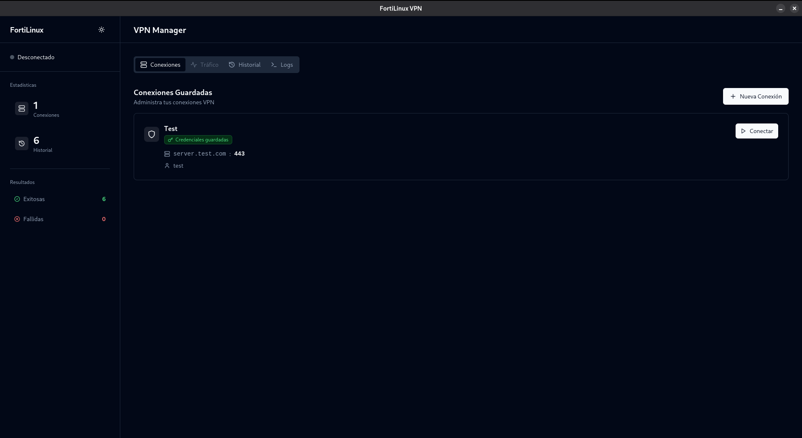
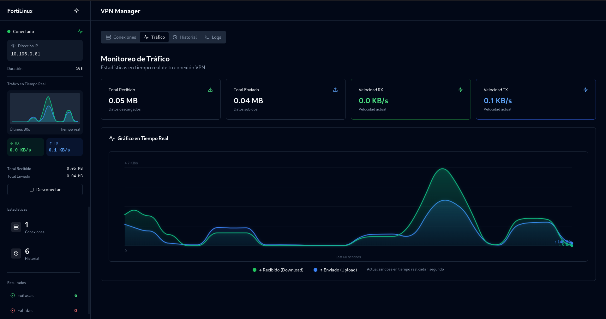
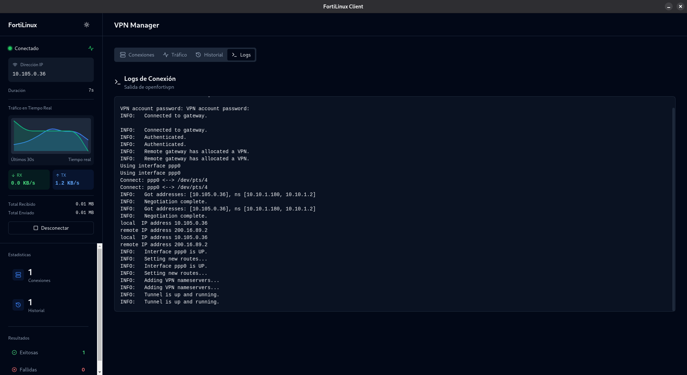

# 🛡️ FortiLinux Client

> Cliente VPN alternativo para FortiClient en Linux. Creado porque el cliente oficial es un desastre y está lleno de bugs.


---

## 📸 Capturas de Pantalla

<div align="center">

### Gestión de Conexiones

*Administra múltiples conexiones VPN con contraseñas guardadas y certificados*

### Monitoreo de Tráfico

*Gráficos detallados de tráfico RX/TX con histórico suavizado*

### Logs en Tiempo Real

*Visualización en vivo de los logs de openfortivpn*

</div>

---

## 📑 Índice

- [Capturas](#-capturas-de-pantalla)
- [¿Por qué?](#-por-qué)
- [Características](#-características)
- [Requisitos](#-requisitos)
- [Instalación](#-instalación)
- [Desarrollo](#-desarrollo)
- [Compilar](#-compilar)
- [Estructura](#-estructura-del-proyecto)
- [Cómo Funciona](#-cómo-funciona)
- [Stack Técnico](#-stack-técnico)
- [Contribuir](#-contribuir)
- [Autor](#-autor)

---

## 🤔 ¿Por qué?

El cliente oficial de FortiClient para Linux es **prácticamente inusable**. Crashes constantes, errores sin handlear, problemas de permisos... un desastre completo.

Esta alternativa usa **openfortivpn** por debajo (que funciona perfecto) y le pone una interfaz decente encima.

## ✨ Características

- 🎨 **Interfaz moderna** con shadcn/ui y Tailwind CSS
- 🔔 **Tray icon dinámico** que cambia según el estado (verde/gris/rojo)
- 💾 **Gestión de conexiones** - guardá múltiples VPNs con contraseñas
- 📊 **Monitoreo en tiempo real** - gráficos suavizados de tráfico RX/TX
- 📜 **Historial de conexiones** con badges de estado
- 🌓 **Modo claro/oscuro**
- 📟 **Logs en vivo** de openfortivpn
- 🏗️ **Arquitectura limpia** - hooks y componentes modulares (principios SOLID)

## 📋 Requisitos

### Sistema Operativo
- Cualquier distro de Linux (probado en **Debian/Ubuntu**)

### Dependencias Necesarias

```bash
# Cliente VPN (obligatorio)
sudo apt install openfortivpn

# PolicyKit para permisos (obligatorio)
sudo apt install policykit-1

# Tray icon (opcional pero recomendado)
sudo apt install libappindicator3-1
```

### Para Desarrollo
- **Node.js** 18 o superior
- **npm** 9 o superior

## 📦 Instalación

### Opción 1: Paquete DEB

```bash
sudo dpkg -i fortilinux-client_1.0.0_amd64.deb
fortilinux-client
```

### Opción 2: AppImage (Portable)

```bash
chmod +x FortiLinux-Client-*.AppImage
./FortiLinux-Client-*.AppImage
```

### Opción 3: Desde Código

```bash
git clone https://github.com/vonkaster/fortilinux-client
cd fortilinux-client
npm install
npm start
```

### ⚡ Configuración de Permisos (Opcional pero Recomendado)

Por defecto, cada vez que conectes te pedirá contraseña de sudo. Para evitarlo, elige una de estas opciones:

#### Opción A: Sudoers (Más simple, recomendado)

```bash
sudo ./install-sudoers.sh
```

Agrega una regla a `/etc/sudoers.d/` para tu usuario específico. Simple y directo.

#### Opción B: PolicyKit (Más seguro para entornos multiusuario)

```bash
sudo ./install-polkit.sh
```

Instala una política de PolicyKit. Mejor para sistemas con múltiples usuarios.

**Para desinstalar:**
```bash
# Si usaste sudoers:
sudo rm /etc/sudoers.d/fortilinux-vpn

# Si usaste polkit:
sudo rm /usr/share/polkit-1/actions/com.fortilinux.client.policy
```

## 🛠️ Desarrollo

```bash
npm install    # Instalar dependencias
npm start      # Levantar dev server + Electron
```

El comando `npm start` ejecuta:
- **Vite** en `http://localhost:5173` (frontend)
- **Electron** que carga el frontend

Hot reload incluido. Los cambios se ven al instante.

## 🏗️ Compilar

```bash
# Generar .deb + .AppImage
npm run dist:linux

# Solo AppImage
npm run build && electron-builder --linux AppImage

# Solo DEB
npm run build && electron-builder --linux deb
```

**Salida**: Los archivos quedan en `release/`

**Primera compilación**: 5-10 minutos (descarga dependencias de Electron)  
**Compilaciones siguientes**: 1-2 minutos

## 📁 Estructura del Proyecto

```
fortilinux-client/
│
├── 📂 electron/
│   ├── main.js              # Entry point (inicializa IPC + lifecycle)
│   ├── preload.js           # Bridge seguro IPC
│   │
│   ├── 📂 app/
│   │   └── lifecycle.js      # Ciclo de vida de Electron (single instance, eventos)
│   ├── 📂 ipc/
│   │   └── handlers.js       # Handlers IPC (get-config, connect-vpn, etc.)
│   ├── 📂 config/
│   │   ├── paths.js          # Paths (configDir, isDev, etc.)
│   │   └── storage.js        # Persistencia (config.json / history.json)
│   ├── 📂 utils/
│   │   ├── logger.js         # Logger centralizado
│   │   └── permissions.js    # sudo/pkexec helpers
│   ├── 📂 window/
│   │   └── manager.js        # Ventana principal (createWindow, sendToWindow)
│   ├── 📂 tray/
│   │   └── manager.js        # System tray (icono + menú)
│   ├── 📂 vpn/
│   │   ├── state.js          # Estado global VPN
│   │   ├── config.js         # Generación de config openfortivpn + args
│   │   └── connection.js     # Conectar / desconectar / cancelar
│   └── 📂 traffic/
│       └── monitor.js        # Monitoreo de tráfico (ppp0/tun0/vpn0)
│
├── 📂 src/
│   ├── 📂 components/
│   │   ├── connections/     # Gestión de VPNs
│   │   ├── history/         # Historial
│   │   ├── layout/          # Sidebar, TopBar, Widgets
│   │   ├── logs/            # Visor de logs
│   │   ├── traffic/         # Monitor de tráfico
│   │   └── ui/              # shadcn components
│   │
│   ├── 📂 hooks/            # Lógica de negocio
│   │   ├── useVPN.ts        # Estado y control VPN
│   │   ├── useConnections.ts
│   │   ├── useHistory.ts
│   │   └── useTheme.ts
│   │
│   ├── App.tsx              # Componente raíz
│   ├── types.ts             # TypeScript interfaces
│   └── main.tsx             # Entry point
│
├── 📂 icons/                # Iconos del tray (PNG)
└── 📂 release/              # Builds generados
```

## ⚙️ Cómo Funciona

1. **UI (React)** se comunica con el proceso principal de Electron vía IPC
2. El **proceso principal** ejecuta `openfortivpn` con `pkexec` (permisos sudo)
3. Los **logs** se capturan en tiempo real desde stdout/stderr
4. El **tráfico** se lee directamente de `/sys/class/net/ppp0/statistics/`
5. La **config** se guarda en `~/.config/fortilinux-client/`

### Datos Monitoreados

| Métrica | Descripción | Fuente |
|---------|-------------|--------|
| **RX** | Datos recibidos (download) | `/sys/class/net/ppp0/statistics/rx_bytes` |
| **TX** | Datos enviados (upload) | `/sys/class/net/ppp0/statistics/tx_bytes` |
| **IP** | IP asignada por el VPN | Parseo de logs de openfortivpn |

Los gráficos usan **Moving Average** (ventana de 5) + **curvas Bézier** para suavizado.

## 🚀 Stack Técnico

| Categoría | Tecnología |
|-----------|------------|
| **Desktop** | Electron 28 |
| **Frontend** | React 18 + TypeScript 5.3 |
| **Build** | Vite 5 |
| **UI** | shadcn/ui + Tailwind CSS |
| **Components** | Radix UI (accesibles) |
| **Icons** | Lucide React |
| **VPN Backend** | openfortivpn |
| **Storage** | electron-store (JSON) |

## 🤝 Contribuir

Todas las contribuciones son bienvenidas:

- 🐛 **Issues** - Reportá bugs, sugerí features
- 🔀 **Pull Requests** - Mejorá el código, agregá funcionalidades
- 🍴 **Fork** - Hacé tu propia versión
- ⭐ **Star** - Si te sirvió el proyecto

### Antes de contribuir:

- El proyecto sigue **principios SOLID**
- Los componentes son **modulares y reutilizables**
- El código está en **inglés**, los textos UI en **español**
- Los logs son **profesionales** (timestamps ISO, niveles claros)

## 👤 Autor

**Franco Caminos**

[](https://github.com/vonkaster)

## 📄 Licencia

**MIT** - Hacé lo que quieras con el código.

---

<div align="center">

💢 **hecho con bronca porque el forticlient no funciona** 💢

</div>